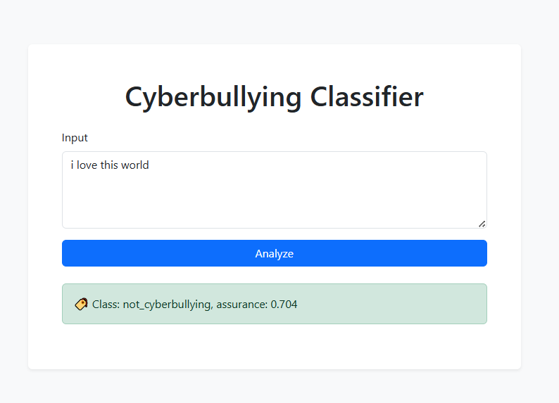

# Transformer Text Classifier API

A Flask app for text classification using a custom Transformer model trained on PyTorch.
[](https://huggingface.co/spaces/reginafeles/transformer2.0)
---

## Project Structure
```
├── model/
  └── load.py # Model loading, tokenization and encoding
│ └── transformer_classifier.pt # Model
├── static/
│ └── script.js # Interactions with the Flask API
├── templates/
│ └── index.html # UI
├── app.py # FLask-app
├── README.md # Doc
```
##Architecture

* Embedding
* TransformerEncoder(2 layers, 4 heads)
* Linear-classifier

##UI


##Run code locally
```
python app.py
```
